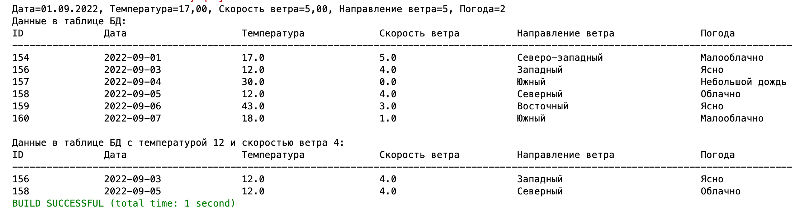
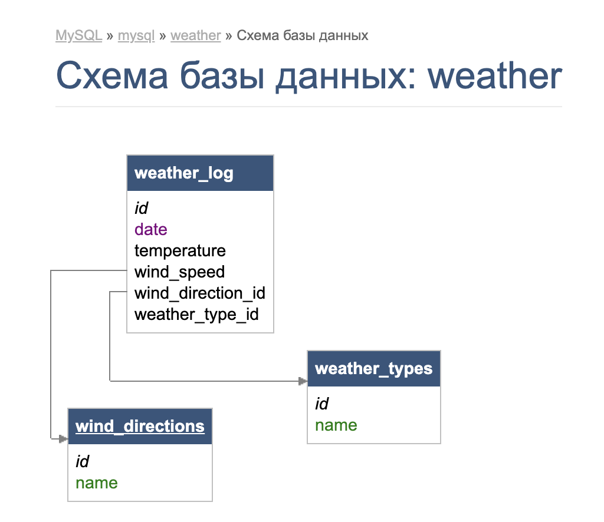
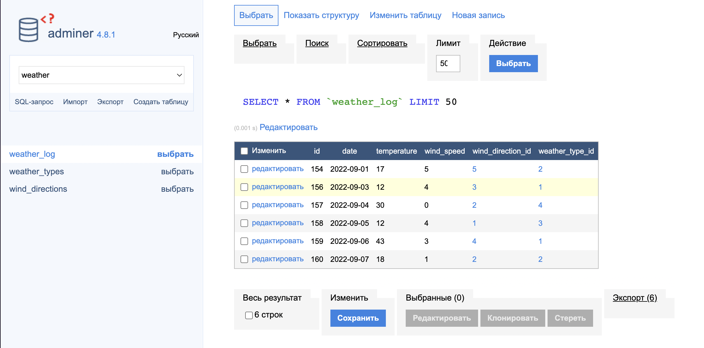

# Task 3 - Java Spring + MySQL
База данных находится в докере. В качестве графического интерфейса использовался Adminer.
В программе задействованы 3 класса, так как таблицы связаны внешними ключами.







```
CREATE TABLE `weather_log` (
  `id` int NOT NULL AUTO_INCREMENT,
  `date` date DEFAULT NULL,
  `temperature` double DEFAULT NULL,
  `wind_speed` double DEFAULT NULL,
  `wind_direction_id` int DEFAULT NULL,
  `weather_type_id` int DEFAULT NULL,
  PRIMARY KEY (`id`),
  KEY `wind_direction_id` (`wind_direction_id`),
  KEY `weather_type_id` (`weather_type_id`),
  CONSTRAINT `weather_log_ibfk_1` FOREIGN KEY (`wind_direction_id`) REFERENCES `wind_directions` (`id`) ON DELETE CASCADE ON UPDATE CASCADE,
  CONSTRAINT `weather_log_ibfk_2` FOREIGN KEY (`weather_type_id`) REFERENCES `weather_types` (`id`) ON DELETE CASCADE ON UPDATE CASCADE
) ENGINE=InnoDB DEFAULT CHARSET=utf8mb4 COLLATE=utf8mb4_general_ci;

CREATE TABLE `weather_types` (
  `id` int NOT NULL AUTO_INCREMENT,
  `name` varchar(255) CHARACTER SET utf8mb4 COLLATE utf8mb4_general_ci DEFAULT NULL,
  PRIMARY KEY (`id`)
) ENGINE=InnoDB DEFAULT CHARSET=utf8mb4 COLLATE=utf8mb4_general_ci;

INSERT INTO `weather_types` (`id`, `name`) VALUES
(1,	'Ясно'),
(2,	'Малооблачно'),
(3,	'Облачно'),
(4,	'Небольшой дождь'),
(5,	'Сильный дождь'),
(6,	'Снег с дождем'),
(7,	'Небольшой снег'),
(8,	'Сильный снег'),
(9,	'Туман'),
(10,	'Смог'),
(11,	'Град');

CREATE TABLE `wind_directions` (
  `id` int NOT NULL AUTO_INCREMENT,
  `name` varchar(255) CHARACTER SET utf8mb4 COLLATE utf8mb4_general_ci DEFAULT NULL,
  PRIMARY KEY (`id`)
) ENGINE=InnoDB DEFAULT CHARSET=utf8mb4 COLLATE=utf8mb4_general_ci;

INSERT INTO `wind_directions` (`id`, `name`) VALUES
(1,	'Северный'),
(2,	'Южный'),
(3,	'Западный'),
(4,	'Восточный'),
(5,	'Северо-западный'),
(6,	'Северо-восточный'),
(7,	'Юго-западный'),
(8,	'Юго-восточный');
```
