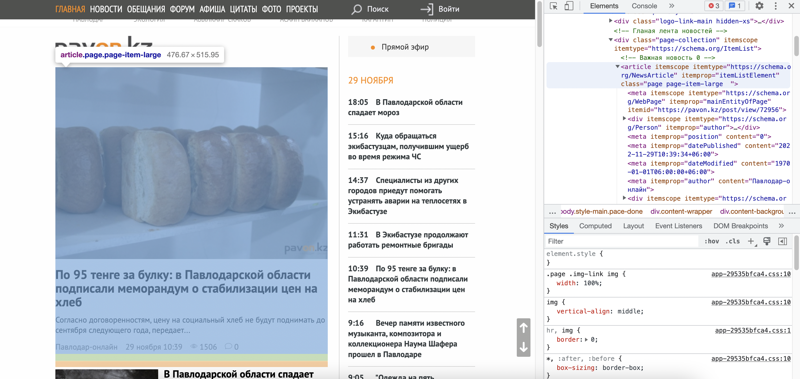
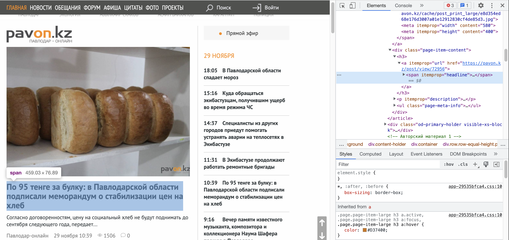
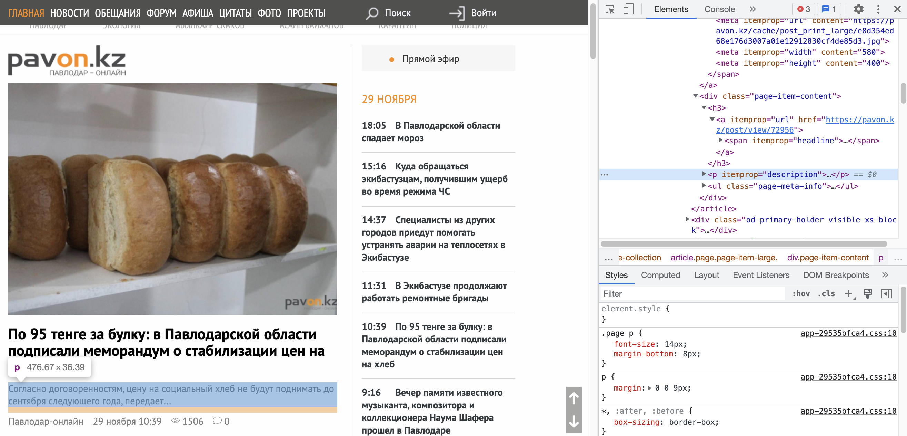
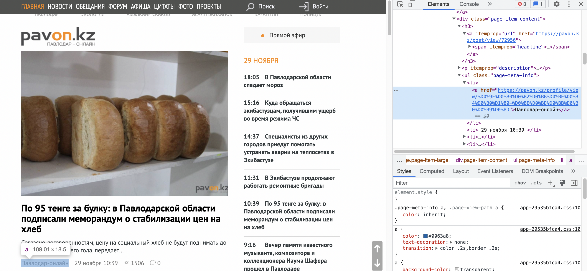
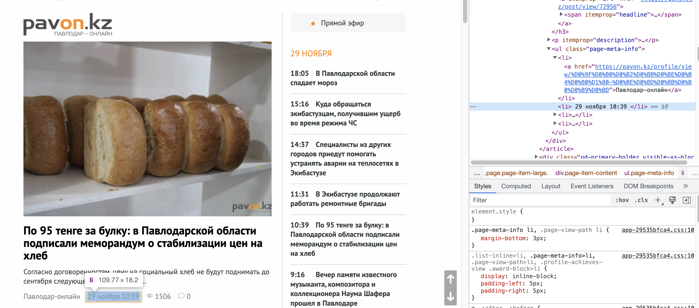
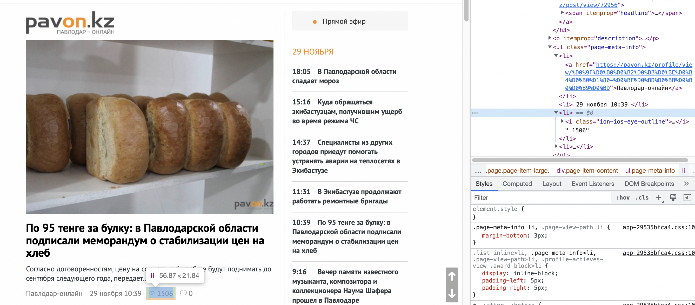
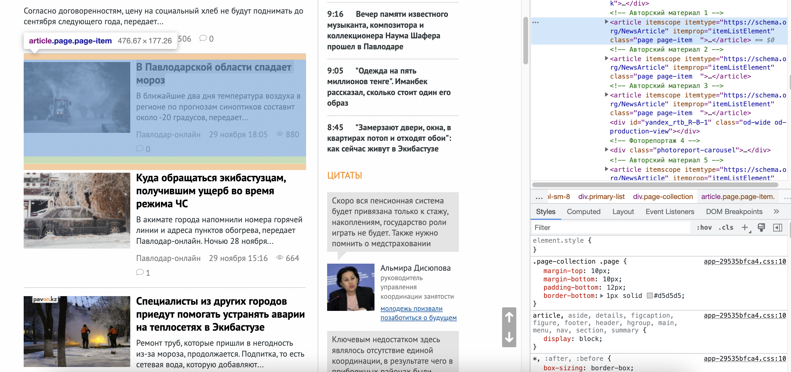
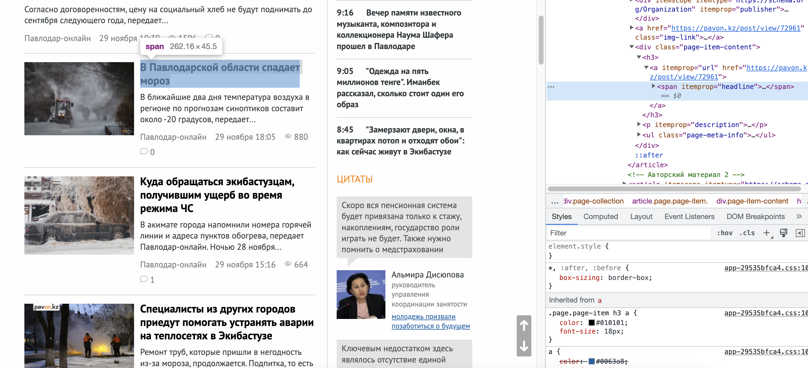

# Task 8 - JSOUP

Загрузка последних новостей с Павлодар онлайн


## Описание примеров селекторов

``` java
Element e = doc.select("article.page-item-large").get(0); 
// Ищем в документе "<article class="page-item-large"> - главный пост
```


``` java
post.setTitle(e.select("h3 a span").get(0).text()); 
// Ищем в блоке элемент span в ссылке в заголовке и получаем его содержимое
```


``` java
post.setText(e.select("p").get(0).text()); 
// Ищем в блоке элемент p и получаем его содержимое
```


``` java
post.setAuthor(e.select("ul li:nth-child(1) a").get(0).text()); 
// Ищем в блоке ссылку в первом элементе li в теге ul и получаем его содержимое
```


``` java
post.setDate(e.select("ul li:nth-child(2)").get(0).text()); // Ищем в блоке второй элемент li в теге ul и получаем его содержимое
```


``` java
post.setViewsCount(e.select("ul li:nth-child(3)").get(0).text()); 
// Ищем в блоке третий элемент li в теге ul и получаем его содержимое
```


``` java
ArrayList<String> related = new ArrayList<>();
for (Element el : doc.select("article.page-item")) {
    related.add(el.select("h3 a span").get(0).text());
} 
// Ищем в документе "<article class="page-item"> и в каждом из них ищем элемент span в ссылке в заголовке и получаем его содержимое
```


